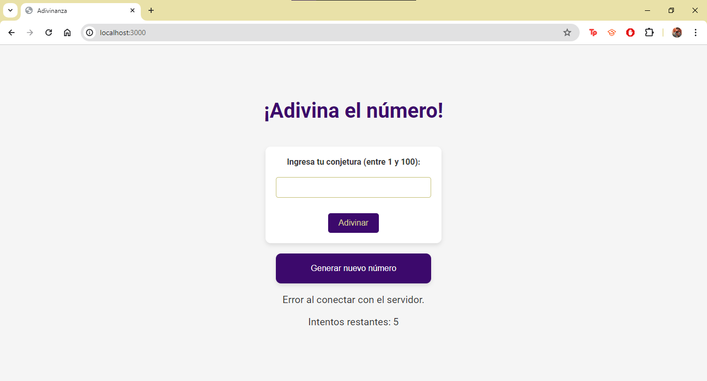

# Proyecto de Adivinanza con Kubernetes y RabbitMQ

Este proyecto implementa un juego de adivinanza de números que utiliza Kubernetes para la orquestación de contenedores y RabbitMQ como sistema de mensajería.

## Tabla de Contenidos

- [Descripción](#descripción)
- [Arquitectura](#arquitectura)
- [Requisitos Previos](#requisitos-previos)
- [Configuración del Proyecto](#configuración-del-proyecto)
- [Despliegue en Kubernetes](#despliegue-en-kubernetes)
- [Uso](#uso)
- [Contribuciones](#contribuciones)
- [Licencia](#licencia)

## Descripción

Este proyecto es una implementación de un juego de adivinanza de números. Los usuarios pueden intentar adivinar un número generado aleatoriamente entre 1 y 100. El backend de la aplicación está dividido en microservicios desplegados en un clúster de Kubernetes, y utiliza RabbitMQ para la comunicación entre servicios.

## Arquitectura

La aplicación está dividida en varios componentes:

1. **Frontend**: Interfaz de usuario que permite a los usuarios ingresar sus conjeturas.
2. **Backend**: Servicio que maneja las conjeturas y proporciona la lógica del juego.
3. **RabbitMQ**: Sistema de mensajería utilizado para la comunicación entre servicios.
4. **Microservicio de Generación de Números Aleatorios**: Genera números aleatorios y los proporciona al backend.

## Imagen del Sistema



## Requisitos Previos

- [Docker](https://www.docker.com/)
- [Kubernetes](https://kubernetes.io/)
- [kubectl](https://kubernetes.io/docs/tasks/tools/install-kubectl/)
- [Minikube](https://minikube.sigs.k8s.io/docs/) (opcional para pruebas locales)
- [RabbitMQ](https://www.rabbitmq.com/)

## Configuración del Proyecto

1. Clona el repositorio:

    ```bash
    git clone https://github.com/tu-usuario/tu-repositorio.git
    cd tu-repositorio
    ```

2. Construye las imágenes Docker:

    ```bash
    docker build -t adivinanza-frontend ./frontend
    docker build -t adivinanza-backend ./backend
    docker build -t randomnumber-service ./randomnumber
    ```

3. Empuja las imágenes a tu registro de Docker (opcional):

    ```bash
    docker tag adivinanza-frontend tu-usuario/adivinanza-frontend
    docker push tu-usuario/adivinanza-frontend
    
    docker tag adivinanza-backend tu-usuario/adivinanza-backend
    docker push tu-usuario/adivinanza-backend
    
    docker tag randomnumber-service tu-usuario/randomnumber-service
    docker push tu-usuario/randomnumber-service
    ```

## Despliegue en Kubernetes

1. Aplica los despliegues y servicios de Kubernetes:

    ```bash
    kubectl apply -f kubernetes/rabbitmq-deployment.yaml
    kubectl apply -f kubernetes/rabbitmq-service.yaml
    kubectl apply -f kubernetes/guessing-game-deployment.yaml
    kubectl apply -f kubernetes/guessing-game-service.yaml
    kubectl apply -f kubernetes/randomnumber-deployment.yaml
    kubectl apply -f kubernetes/randomnumber-service.yaml
    ```

2. Verifica que los pods estén corriendo:

    ```bash
    kubectl get pods
    kubectl get services
    ```

## Uso

1. Accede a la aplicación frontend desde tu navegador. Si estás usando Minikube, puedes obtener la URL con:

    ```bash
    minikube service guessing-game-service
    ```

2. Ingresa tus conjeturas y juega el juego de adivinanza.

## Contribuciones

Las contribuciones son bienvenidas. Por favor, sigue los siguientes pasos:

1. Haz un fork del repositorio.
2. Crea una nueva rama (`git checkout -b feature/nueva-funcionalidad`).
3. Realiza tus cambios y haz commit de los mismos (`git commit -am 'Agrega nueva funcionalidad'`).
4. Haz push de la rama (`git push origin feature/nueva-funcionalidad`).
5. Abre un Pull Request.
